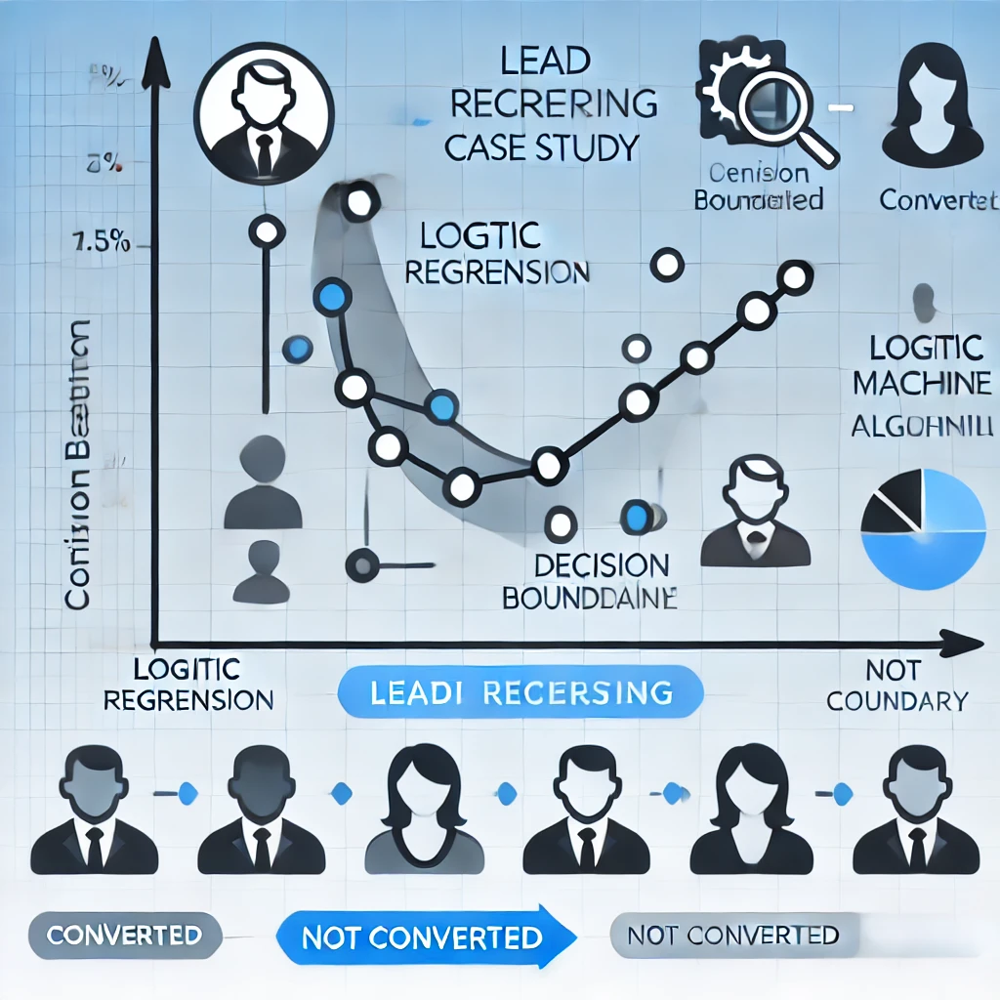

# Data Science Portfolio
---

## Exploratory Data Analysis (EDA) Projects: Uncovering Insights through Data Exploration

### Case Study : Predicting Loan Default Patterns through Exploratory Data Analysis (EDA) in the Banking Sector  

  
This project involved analyzing customer data to identify patterns in loan defaults. Using exploratory data analysis (EDA), I investigated key variables that influence whether a customer is likely to default on a loan. Insights gained from this analysis help banks assess risk and make informed decisions in lending. Key skills demonstrated include data cleaning, feature selection, statistical analysis, and visualization to detect trends related to defaulters.

  

  
----  

## Machine Learning Projects: Driving Innovation through Predictive Modeling

### Case Study: Optimizing Lead Scoring with Logistic Regression for Enhanced Sales Strategies

This case study addresses the challenge faced by X Education, which sells online courses to professionals. Despite acquiring around 100 leads daily, only 30 convert into sales. To enhance this, a Logistic Regression model was developed to assign lead scores between 0 and 100, helping the sales team prioritize 'Hot Leads' likely to convert. The model is adaptable to future requirements and market changes. A comprehensive analysis and implementation recommendations were also compiled for presentation, showcasing analytical skills and expertise in predictive modeling to solve real-world business challenges.
  

  

  
### Case Study: Demand Prediction for Bike Sharing Using Linear Regression

This project analyzes bike-sharing data to predict demand using a linear regression model. Key variables identified include holiday, temperature, windspeed, seasonal factors (Winter and Summer), September, year (2019), and weather conditions (Light Snow, Mist + Cloudy). Notably, holidays, windspeed, and misty or snowy weather negatively impact demand, which aligns with intuitive expectations. Through data preprocessing and exploratory data analysis (EDA), the model provides insights into peak usage times and the effects of weather on rentals. This work demonstrates skills in data analysis, feature engineering, modeling, and evaluation using Python and relevant libraries.

  

----  

## SQL Case Studies: Data-Driven Insights for Strategic Decision Making

### Case Study: Strategic Insights for Global Film Release from RSVP Movies

In this case study, I analyzed data for RSVP Movies, a prominent Indian film production company, in preparation for a global film release in 2022. Using MySQL, I examined three years of previous releases to uncover insights on box office performance, audience demographics, and marketing strategies. By extracting key metrics such as average ticket sales and genre performance, RSVP Movies was able to identify trends and optimize marketing efforts. The findings provided actionable recommendations, positioning the company for a successful global release and showcasing the impact of data analysis on strategic decision-making.  

  

